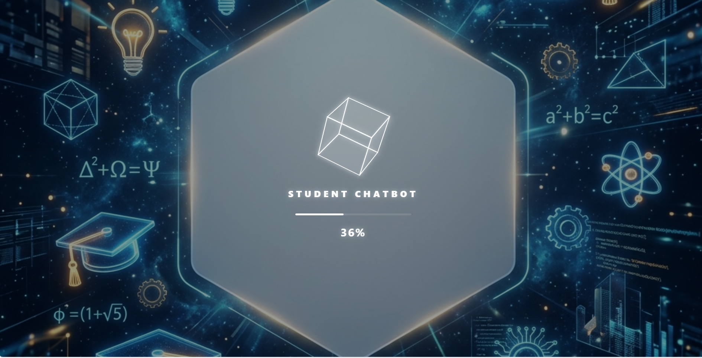
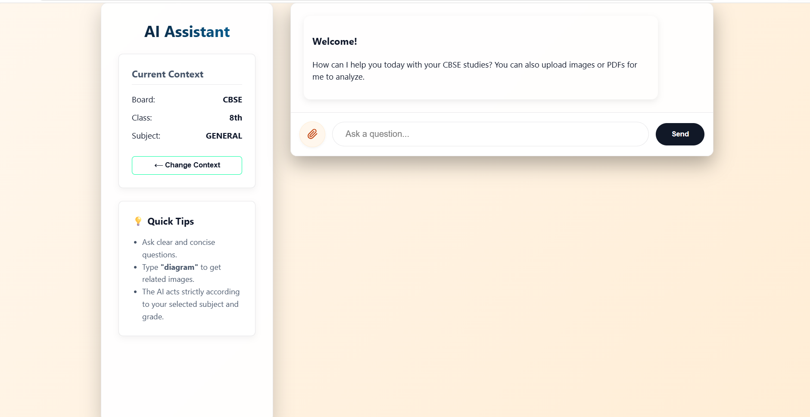
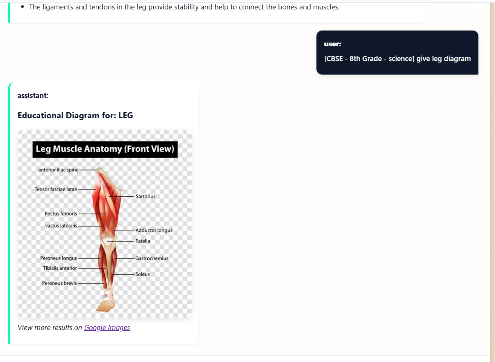

# Student Assistant Chatbot

An AI-powered study companion designed for Indian students up to 10th standard. It provides clear, syllabus-based answers in a simple and interactive manner, helping students learn more effectively in their daily studies.

## Live Demo
Check out the live application here: [student-assistant-chatbot.vercel.app](https://student-assistant-chatbot.vercel.app)

---

## Features

- **Personalized Onboarding**: Students can select their education board (CBSE, ICSE, State Board), class, and subject to receive tailored assistance.
- **Subject-Specific Support**: Dedicated AI assistance for Mathematics, Science, Social Studies, and Computers to ensure accurate and relevant explanations.
- **Multi-Modal Support**: 
  - **Image Processing**: Upload notes or textbook photos for instant analysis using OCR.
  - **PDF Integration**: Ask questions directly from PDF documents such as assignments or e-books.
- **Modern User Interface**: Clean, responsive design with smooth navigation and well-structured, step-by-step answers.
- **Visual Learning Support**: Automatically generates diagrams and visual references to improve conceptual understanding.
- **Advanced AI Integration**: Powered by **Groq**, **OpenAI**, and **Perplexity** for lightning-fast and reliable responses.

---

## Technology Stack

### **Frontend**
- **React (Vite)**: Modern, lightning-fast foundation.
- **CSS3**: Custom polished styling.
- **React Markdown**: Beautifully rendered AI responses.

### **Backend**
- **Node.js & Express**: Scalable server-side architecture.
- **Tesseract.js**: For high-accuracy Optical Character Recognition (OCR).
- **pdf-parse**: Reliable server-side PDF content extraction.
- **AI SDKs**: Integrated Groq and OpenAI providers.

---

## Visual Preview

### 🖥️ Onboarding & Setup

*Personalized onboarding for Board, Class, and Subject selection.*

### 💬 Interactive Chat

*Concise, syllabus-aligned answers with file analysis support.*

### 📊 Educational Diagrams

*AI-generated visual aids for complex scientific concepts.*

---

## Getting Started

### 1. Clone the Repository
```bash
git clone https://github.com/chinmay09gowda/student-assistant-chatbot.git
cd student-assistant-chatbot
```

### 2. Backend Setup
```bash
cd backend
npm install
```

**Configure Environment Variables**  
Create a `.env` file in the `backend/` directory:
```env
PORT=5001
ALLOWED_ORIGIN=http://localhost:5173
GROQ_API_KEY=your_key_here
OPENAI_API_KEY=your_key_here
```

**Run the Backend Server**
```bash
npm run dev
```

### 3. Frontend Setup
```bash
cd ../frontend
npm install
npm run dev
```

---

## License

This project is open-source and available for contributions.  

*Developed to support students in achieving better understanding and academic performance.*